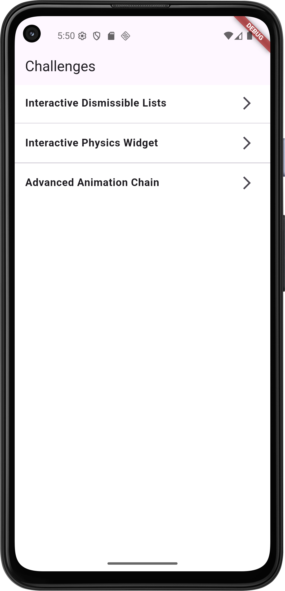
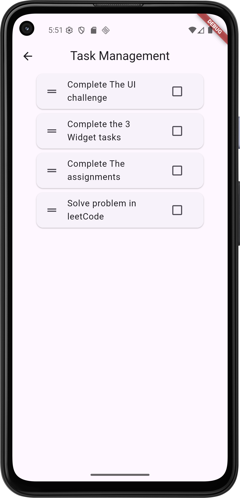
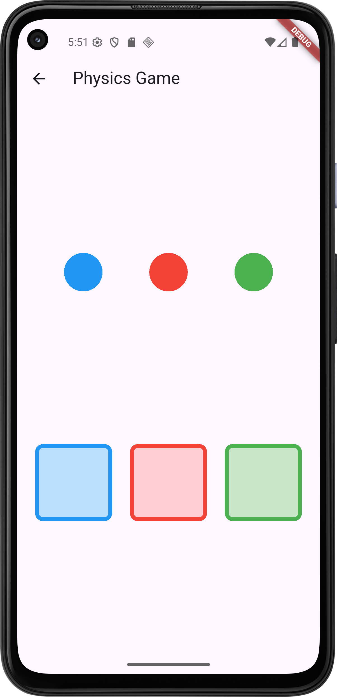
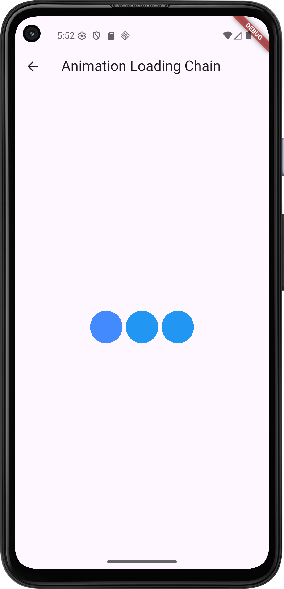

# Flutter Widget Implementation Challenges

This repository contains solutions to three interactive Flutter widget challenges. Each challenge focuses on core Flutter concepts such as list manipulation, drag-and-drop physics, and advanced animations.

**Result:**

---

## 📌 Challenge 1: Interactive Dismissible Lists

**Description:**
A task management widget where users can swipe to delete tasks and drag to reorder them. The implementation ensures user control with confirmation dialogs and undo functionality.

**Requirements Implemented:**

* ✅ `Dismissible` for swipe-to-delete
* ✅ `ReorderableListView` for drag-to-reorder
* ✅ Confirmation dialog before deletion
* ✅ Undo deletion with `SnackBar`
* ✅ Includes 3+ sample tasks

**Result:**


**Repo Link:** [GitHub Repo - Challenge 1](https://github.com/yoyo3257/Flutter-Widget-Exploration/tree/main/lib/interactive_dismissible_lists)

---

## 🎨 Challenge 2: Interactive Physics Widget

**Description:**
A drag-and-drop mini simulation where users drag colored balls into matching colored containers. The widget provides visual feedback and success/failure states.

**Requirements Implemented:**

* ✅ Draggable colored balls (3+ colors)
* ✅ Matching colored containers as `DragTarget`s
* ✅ Visual feedback during dragging
* ✅ Success indication for correct matches

**Result:**


**Repo Link:** [GitHub Repo - Challenge 2](https://github.com/yoyo3257/Flutter-Widget-Exploration/tree/main/lib/interactive_physics_widget)

---

## 🔄 Challenge 3: Advanced Animation Chain

**Description:**
A looping loading animation using an `AnimationController` with multiple Tween animations. Three dots scale and fade in sequence to create a smooth, engaging loading effect.

**Requirements Implemented:**

* ✅ Proper `AnimationController` with disposal
* ✅ Sequential animations for 3 dots
* ✅ Combined scale + opacity animations
* ✅ Continuous looping
* ✅ Smooth curves for animation

**Result:**


**Repo Link:** [GitHub Repo - Challenge 3](https://github.com/yoyo3257/Flutter-Widget-Exploration/tree/main/lib/advanced_animation_chain)

---

## 🚀 Getting Started

Clone the repository and run the Flutter project:

```bash
git clone <your-repo-link>
cd <repo-folder>
flutter pub get
flutter run
```

---

## 📚 Topics Covered

* Gesture handling and interactivity
* List manipulation and undo patterns
* Drag-and-drop mechanics (`Draggable`, `DragTarget`)
* Animation chaining with `AnimationController` and `Tween`

---

## 📝 Author

Developed by **Yasmin Hany** as part of the **Flutter MentorShip 3**.
